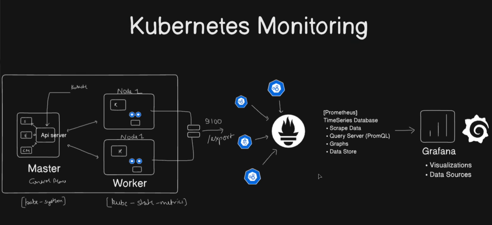
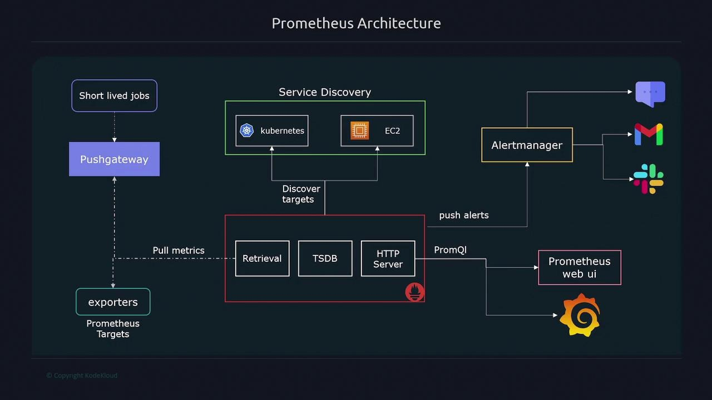

# 🧠 Prometheus & Grafana – Comprehensive Overview

## 📘 Table of Contents

1. [Introduction](#introduction)
2. [Prometheus Toolkit](#prometheus-toolkit)
3. [Grafana Toolkit](#grafana-toolkit)
4. [Loki Toolkit](#loki-toolkit)
5. [Promtail Toolkit](#promtail-toolkit)
6. [Observability Integration](#observability-integration)
7. [Common Use Cases](#common-use-cases)
8. [Best Practices](#best-practices)
9. [References](#references)
10. [Resources](#resources)
11. [Author](#author)

---

## Introduction

**Prometheus**, **Grafana**, **Loki**, and **Promtail** are open-source tools for **metrics, logs, visualization, and alerting** in cloud-native environments.
Together, they form a practical observability stack that helps DevOps engineers, SREs, and developers gain **deep observability** into system performance and reliability.

### Tool Map

| Tool | Primary responsibility | Main query or configuration language |
| ---- | ---------------------- | ------------------------------------ |
| **Prometheus** | Collects and stores metrics | PromQL |
| **Grafana** | Visualizes metrics and logs | Dashboard queries |
| **Loki** | Stores and queries logs | LogQL |
| **Promtail** | Discovers and ships logs to Loki | YAML configuration |



---

## Prometheus Toolkit

**Tools in this section:** Prometheus Server, exporters, PromQL, Alertmanager, Pushgateway, and Kubernetes service discovery.

### What is Prometheus?

**Prometheus** is an open-source **systems monitoring and alerting toolkit** originally built at **SoundCloud**. It collects and stores metrics as **time series data**, recording information with a timestamp and optional labels.

Prometheus is designed for **reliability**, **scalability**, and **self-sufficiency**, making it ideal for **Kubernetes, Docker, and microservices architectures**.

---

### Key Features of Prometheus

* **Multi-dimensional data model** using key-value pairs (labels).
* **Powerful query language (PromQL)** for aggregating and analyzing metrics.
* **Pull-based data collection** via HTTP endpoints (`/metrics`).
* **No external dependencies**; standalone operation.
* **Built-in alerting** through the **Alertmanager**.
* **Service discovery** for dynamic environments like Kubernetes and EC2.
* **Time-series database (TSDB)** optimized for metric storage.

---

### Prometheus Architecture

Prometheus follows a **modular and pull-based architecture**:

```
+----------------+         +---------------------+       +----------------+
|   Exporters /   |        |      Prometheus     |       |   Alertmanager |
|  Instrumented   | -----> |        Server       | ----> | (Alerts, Email,|
|  Applications   |        | (Scraping & Storage)|       | Slack, etc.)   |
+----------------+         +---------------------+       +----------------+
                                       |
                                       |
                                       v
                              +-----------------+
                              | Grafana / API   |
                              | (Visualization) |
                              +-----------------+
```

---

### Core Components of Prometheus

| Component             | Description                                                              |
| --------------------- | ------------------------------------------------------------------------ |
| **Prometheus Server** | The core service that scrapes and stores time-series data.               |
| **Exporters**         | Expose metrics from third-party systems (e.g., Node Exporter, cAdvisor). |
| **Alertmanager**      | Handles alerts sent by Prometheus; routes notifications.                 |
| **Pushgateway**       | Allows ephemeral jobs to push metrics to Prometheus.                     |
| **Service Discovery** | Dynamically identifies targets in Kubernetes, EC2, etc.                  |
| **PromQL Engine**     | Executes queries for visualization and analysis.                         |

---

### Data Model and Metrics Types

Prometheus stores data as **time series**, uniquely identified by:

```
<metric_name>{label1="value1", label2="value2", ...}
```

### Metric Types

| Type          | Description                                                   | Example                      |
| ------------- | ------------------------------------------------------------- | ---------------------------- |
| **Counter**   | Monotonic value that only increases.                          | HTTP requests served.        |
| **Gauge**     | Value that can go up or down.                                 | Memory usage, temperature.   |
| **Histogram** | Samples observations and counts them in configurable buckets. | Request durations.           |
| **Summary**   | Provides quantiles over a sliding time window.                | Request latency percentiles. |

---

### PromQL – Query Language

**PromQL (Prometheus Query Language)** enables **filtering, aggregating, and analyzing metrics** in real time.

### Example Queries

```promql
# CPU usage per instance
rate(node_cpu_seconds_total{mode="user"}[5m])

# HTTP request rate per endpoint
rate(http_requests_total[1m])

# Memory usage of each container
container_memory_usage_bytes{job="kubernetes"}
```

---

### Alerting with Prometheus

Prometheus provides **flexible and rule-based alerting**.

### Alert Flow:

1. Prometheus evaluates **alert rules** based on metrics and thresholds.
2. Alerts are sent to the **Alertmanager**.
3. Alertmanager performs **deduplication, grouping, and routing**.
4. Notifications are sent via **Slack, Email, PagerDuty, Webhooks**, etc.

Example alert rule:

```yaml
groups:
- name: cpu_alerts
  rules:
  - alert: HighCPUUsage
    expr: rate(node_cpu_seconds_total{mode="user"}[5m]) > 0.8
    for: 2m
    labels:
      severity: critical
    annotations:
      summary: "High CPU usage detected"
      description: "CPU usage exceeded 80% for 2 minutes."
```

---

## Grafana Toolkit

**Tools in this section:** Grafana UI, dashboards, data sources, alerting, and the Prometheus and Loki plugins.

### What is Grafana?

**Grafana** is an open-source **analytics and visualization platform** for monitoring and observability.
It integrates with multiple data sources — including Prometheus, Loki, InfluxDB, and Elasticsearch — to create **interactive dashboards and real-time analytics**.

---

### Key Features of Grafana

* **Rich visualization options** (graphs, heatmaps, gauges, tables).
* **Multi-source support** (Prometheus, Loki, MySQL, etc.).
* **Templated dashboards** for dynamic views.
* **Alerting and annotation** support.
* **User authentication and role-based access control (RBAC)**.
* **Dashboard versioning and sharing.**

---

### Grafana Architecture

Grafana’s modular structure allows seamless integration with any monitoring ecosystem.

```
+----------------------+
|     Data Sources     |
|  (Prometheus, Loki)  |
+----------+-----------+
           |
           v
+----------------------+
|   Grafana Backend    |  <--- Handles APIs, Auth, Alerting
+----------+-----------+
           |
           v
+----------------------+
|     Frontend UI      |  <--- Dashboards & Visualization
+----------------------+
```

---

## Loki Toolkit

**Tools in this section:** Loki, LogQL, the Loki HTTP API, and filesystem or object-storage backends.

### What is Loki?

**Loki** is a log aggregation system designed for cloud-native environments. It stores log streams with indexed labels and is queried using **LogQL**. Loki complements Prometheus by providing logs alongside metrics in Grafana.

### How Loki Works

Loki separates a log entry into two parts:

* **Labels** identify a stream. Good examples are `namespace`, `pod`, `container`, `job`, and `app`.
* **Log lines** contain the message and timestamp. Loki does not index every word in the log body, which keeps storage and indexing costs lower than a traditional full-text logging system.

The basic flow is:

```
Application containers
     |
     v
   Promtail / Alloy
     |
     |  HTTP /loki/api/v1/push
     v
   Loki
     |
     |  LogQL queries
     v
  Grafana
```

### Loki Storage

The Loki examples in this repository use **TSDB schema v13** and filesystem storage for local learning environments. The configuration defines a 24-hour index period and a single replica, which keeps a Kind or Minikube cluster simple to run.

For production, use a persistent volume or an object-storage backend such as S3, GCS, or Azure Blob Storage. The example `emptyDir` storage is temporary: logs disappear when the Loki pod is recreated. Loki should also be protected behind an authenticated gateway or restricted network access because the sample configuration disables authentication.

### Loki HTTP API

Useful endpoints for checking a local Loki instance are:

```text
GET  /ready
GET  /loki/api/v1/labels
GET  /loki/api/v1/label/<label-name>/values
GET  /loki/api/v1/query_range
POST /loki/api/v1/push
```

`/ready` confirms that Loki is ready to serve traffic. `/labels` is useful for checking whether a collector has sent any data. A successful Loki deployment can still show no logs when no Promtail or Alloy agent is running.

### LogQL Examples

```logql
# All logs from one namespace
{namespace="default"}

# Logs from one pod
{namespace="default", pod="vote-0"}

# Errors and warnings across selected Kubernetes streams
{namespace=~".+", pod=~".+"} |~ "(?i)error|warn|exception|fatal"

# Count log entries by pod over five minutes
sum by (pod) (count_over_time({namespace=~".+"}[5m]))
```

Start LogQL with label matchers to reduce the search space, then apply filters or parsers to the log content. In Grafana, use the dashboard variables to generate non-empty regular expressions such as `.+` rather than `.*`.

---

## Promtail Toolkit

**Tools in this section:** Promtail, Kubernetes pod discovery, relabeling, pipeline stages, and the Loki push API.

### What is Promtail?

**Promtail** is a log collection agent from the Grafana Loki project. It discovers log files, enriches them with labels such as namespace, pod, and container, and forwards the log entries to Loki through its HTTP push API. In Kubernetes, it is commonly deployed as a **DaemonSet** so each node can read its local container logs.

Promtail is now in maintenance mode for new deployments; **Grafana Alloy** is the recommended successor. It remains useful here as a simple learning example and is included in the Helm and non-Helm setup instructions.

### Promtail Processing Pipeline

Promtail performs several jobs before a log reaches Loki:

1. **Discovers pods** through the Kubernetes API using `kubernetes_sd_configs`.
2. **Relabels metadata** into useful Loki labels such as `namespace`, `pod`, and `container`.
3. **Finds local files** under the node's container-log directory.
4. **Parses CRI records** with the `cri` pipeline stage.
5. **Tracks positions** in a positions file so it can continue from the correct offset after a restart.
6. **Batches and pushes entries** to Loki's `/loki/api/v1/push` endpoint.

The non-Helm manifests in this repository mount `/var/log` and the container runtime log directory, run one Promtail pod per node, and grant read-only Kubernetes discovery permissions. The Helm values configure the same collector pattern and send to:

```text
http://kind-loki.monitoring.svc.cluster.local:3100/loki/api/v1/push
```

### Promtail Labels and Cardinality

Labels are indexed by Loki, so they should be stable and bounded. Namespace, pod, container, application, and environment are generally useful. Avoid putting request IDs, user IDs, full URLs, or other unbounded values into labels; keep those values in the log body and filter them with LogQL when needed.

### Promtail Troubleshooting

Use these checks when Grafana shows **No data**:

```bash
kubectl get pods -n monitoring -l app.kubernetes.io/name=promtail
kubectl logs -n monitoring -l app.kubernetes.io/name=promtail
kubectl get pods -A --show-labels
```

Then check Loki's label endpoint. If it returns an empty label list, the problem is between the collector and Loki. If labels exist but the dashboard is empty, check the dashboard time range, selected namespace and pod, datasource selection, and the LogQL matcher. A healthy Promtail pod alone does not prove that it is reading files or sending entries.

---

## Observability Integration

**Tools in this section:** Prometheus for metrics, Promtail for log collection, Loki for log storage and queries, and Grafana for visualization.

### Prometheus–Grafana–Loki–Promtail Integration

Prometheus provides metrics, Promtail collects logs, Loki stores and queries logs, and Grafana provides the visualization layer.

**Workflow:**

1. Prometheus scrapes metrics and stores them as time series.
2. Grafana queries Prometheus using PromQL.
3. Promtail discovers Kubernetes container logs and sends them to Loki.
4. Loki indexes stream labels and makes log content available through LogQL.
5. Grafana queries Loki using LogQL and correlates logs with metrics.

For the Kubernetes examples in this repository, the Grafana Loki datasource uses the in-cluster Loki service URL, while Promtail sends logs to Loki's `/loki/api/v1/push` endpoint.

**Common Dashboards:**

* System performance (CPU, memory, disk I/O).
* Kubernetes cluster metrics.
* API latency and error rates.
* Application uptime and availability.

---

## Common Use Cases

| Domain               | Use Case                                         |
| -------------------- | ------------------------------------------------ |
| **DevOps & SRE**     | Infrastructure and application monitoring        |
| **Kubernetes**       | Cluster health, pod resource usage               |
| **CI/CD Pipelines**  | Build and deployment performance                 |
| **Microservices**    | API latency and service dependency visualization |
| **Business Metrics** | Real-time SLA, SLO, and KPI tracking             |

---

## Best Practices

* Use **consistent metric naming conventions** (snake_case).
* Leverage **labels** for dimensional metrics.
* Avoid unbounded label cardinality.
* Configure **retention periods** wisely to balance storage.
* Use **recording rules** for frequently queried expressions.
* Keep Grafana dashboards **modular and parameterized**.
* Secure both tools using **authentication and role-based access**.
* Monitor Prometheus itself using **self-metrics (`prometheus_*`)**.
* Keep Loki labels low-cardinality; use stable labels such as namespace, pod, and container.
* Run one log collector per node and give it read access only to the required Kubernetes metadata and log paths.

---

## References

* [Prometheus Official Docs](https://prometheus.io/docs/introduction/overview/)
* [Grafana Documentation](https://grafana.com/docs/)
* [PromQL Cheat Sheet](https://promlabs.com/promql-cheat-sheet/)
* [Alertmanager Configuration Guide](https://prometheus.io/docs/alerting/latest/configuration/)
* [Grafana Dashboards Library](https://grafana.com/grafana/dashboards/)
* [Loki Documentation](https://grafana.com/docs/loki/latest/)
* [Promtail Documentation](https://grafana.com/docs/loki/latest/send-data/promtail/)

## Resources

* [Prometheus Architecture](https://www.youtube.com/watch?v=lVYRR_UNT0M)

## Author
 - Abhishek Rajput
